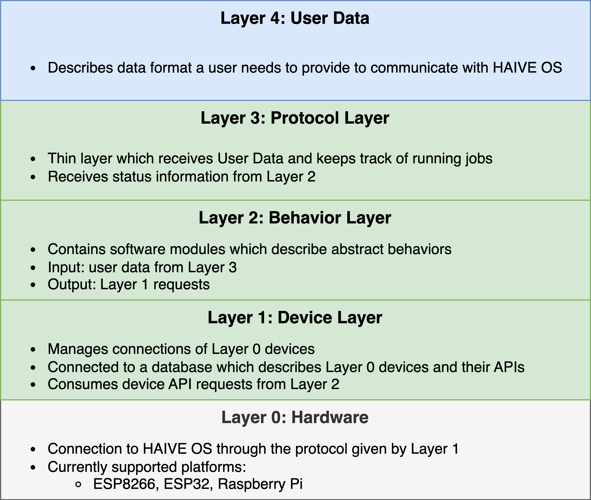

# system architecture

The system architecture of HAIVE OS is based on the design principle of [seperation of concerns](https://en.wikipedia.org/wiki/Separation_of_concerns). (For now) we distinguish 5 layers from bottom to top:

- `Layer 0 | Hardware`: This layer represents the distributed system of HAIVE. It contains all endpoint devices that implement some kind functionality. What all of these devices have in common from the viewpoint of HAIVE OS is that their hardware interface for communication is usually a WiFi chip (e.g. ESP or Raspberry Pi). The responsibility of this layer lies with implementing a functionality and exposing that functionality through some device API.
- `Layer 1 | Device Layer`: This layer mainly consists of a centralized system that manages the connections of all Layer 0 devices. The system has access to a device database which describes the nature of Layer 0 devices and their APIs. It also provides an interface to devices to upper layers and consumes device API requests. (Currently) the system does not handle any kind of request scheduling, which leaves it open to the developer to have a device of layer 0 receive commands on a on-by-one basis or in bulk. Any scheduling that does not happen in the hardware layer should therefore be implemented in Layer 2 or an intermediate Layer 1.5.
- `Layer 2 | Behavior Layer`: This layer contains software modules that implement abstract behaviors using information provided by Layer 1. An example of a Behavior Layer module is the [hos_l2_proxy](https://github.com/Molcure/HAIVE-OS/blob/master/docs/hos_l2_proxy/) package which implements the L2 protocol or the pathplaning behavior shown in [this example](TODO). Most of the work of the Behavior Layer still has to be done.
- `Layer 3 | Protocol Layer`: This layer is supposed to manage user requests for jobs for the HAIVE OS. It will be the interface that data from the UI will be passed to.
- `Layer 4 | User Data`: This layer should describe the data format of the data needed to execute protocols on the HAIVE system. This data will be produced by an updated version of the HAIVE UI.
